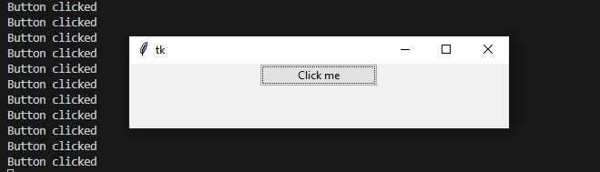
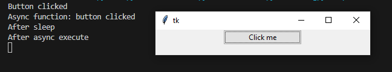

=============
Quickstart
=============

The very first thing we need to do is create our Tkinter application.
This step does not require the use of our library yet.

.. code-block:: python
    :caption: Basic tkinter application - without Tkinter-Async-Execute

    from tkinter import ttk
    import tkinter as tk

    class Application:
        def __init__(self):
            root = tk.Tk()
            ttk.Button(root, text="Click me", command=self.button_click_command, width=20).pack(padx=20)
            self.root = root

        def button_click_command(self):
            print("Button clicked")

        def run(self):
            self.root.mainloop()

    if __name__ == "__main__":
        app = Application()
        app.run()

    
    The result of the above code.

Now let's add our async functionality.

.. code-block:: python
    :emphasize-lines: 4, 5, 14-17, 21, 31, 33
    
    from tkinter import ttk
    import tkinter as tk

    import tk_async_execute as tae
    import asyncio

    class Application:
        def __init__(self):
            root = tk.Tk()
            ttk.Button(root, text="Click me", command=self.button_click_command, width=20).pack(padx=20)
            self.root = root

        async def button_click_async(self):
            print("Async function: button clicked")
            await asyncio.sleep(5)
            print("After sleep")

        def button_click_command(self):
            print("Button clicked")
            tae.async_execute(self.button_click_async(), wait=True, visible=False, pop_up=False)
            print("After async execute")

        def run(self):
            self.root.mainloop()

    if __name__ == "__main__":
        app = Application()
        tae.start()
        app.run()
        tae.stop()

    The result of the above code.

In the above code, we have started the asyncio event loop with the :func:`tk_async_execute.start()` function, added
an async method and called that async method with the :func:`tk_async_execute.async_execute()` function from the
button command handler function. The async code was executed in a blocking mode, meaning that ``button_click_command``
waited for ``button_click_async`` to finish (``wait=True``), we chose to not show the execution window (``visible=False``)
and decided to allow other interactions (eg. more button clicks) to occur while our async method was being executed (``pop_up=False``).
At the end of our code, there is a call to the :func:`tk_async_execute.stop()` function, which get's called after
we close our application window, the purpose of which is to stop the asyncio event loop running in the background.
